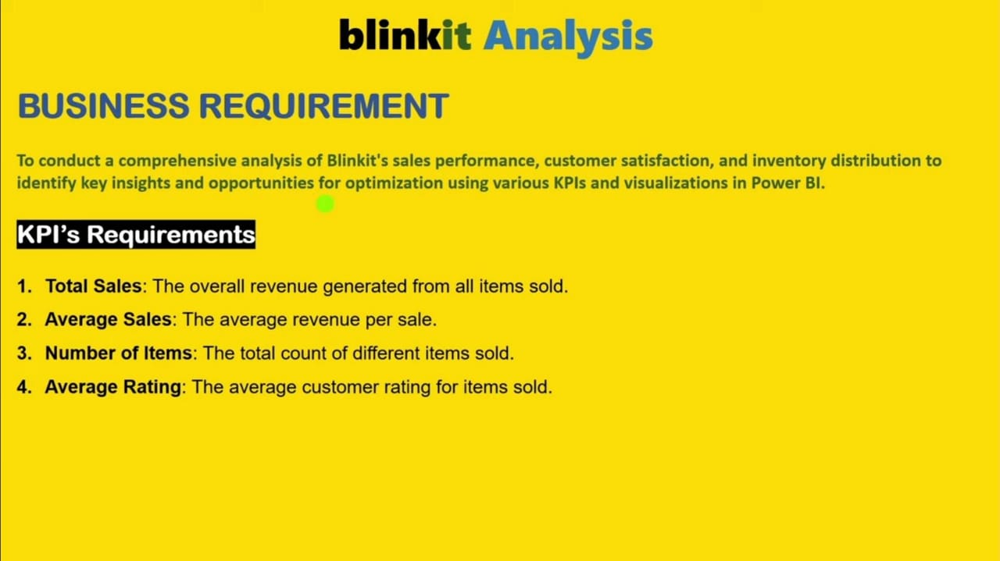
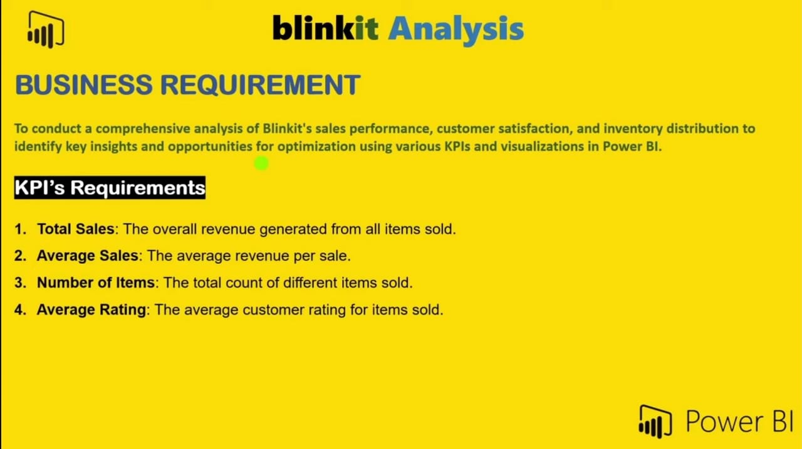
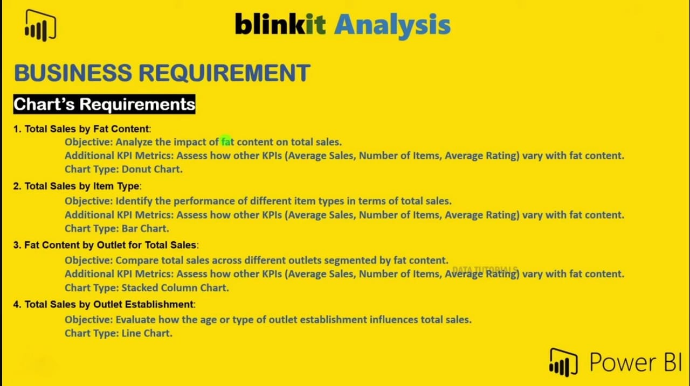

# Blinkit Data Analysis 📦

This project provides a complete sales and performance analysis of Blinkit using **Excel**, **Power BI**, and **Python (Jupyter)**. It explores business KPIs, visualizes trends, and presents actionable insights through dashboards.

---

## 📌 Business Objectives

- Analyze the impact of fat content, item type, and outlet size on sales
- Assess geographic distribution and outlet performance
- Track sales KPIs like Total Sales, Average Sales, Number of Items, and Average Rating

---

## 📊 KPIs Tracked

- **Total Sales** – Overall revenue
- **Average Sales** – Average revenue per sale
- **Number of Items** – Total unique items sold
- **Average Rating** – Customer satisfaction score

---

## 🧰 Tools Used

- **Excel** – Pivot tables, charts
- **Power BI** – Interactive dashboards, DAX
- **Python** – EDA using pandas, matplotlib, seaborn

---

## 📸 Dashboard Previews

### 📗 Excel Dashboards

.jpeg)

---

### 📘 Power BI Dashboards
**KPIs & Sales Breakdown:**

  
  
.jpeg)

---

### 🐍 Python (Jupyter Output)
**Chart-Based Insights:**

  
.jpeg)

📌 To view the full Python report:  
👉 [Download this HTML](python/blinkit_analysis_in_python.html) and open in your browser

---

## 📂 Folder Structure

```bash
Blinkit_Analysis/
├── excel/
│   └── BlinkIT Analysis Project.xlsx
├── powerbi/
│   └── PowerBI blinkit dashboard.pbix
├── python/
│   └── blinkit_analysis_in_python.html
├── images/
│   └── All dashboard screenshots
└── README.md
